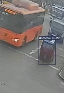
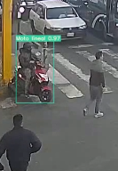
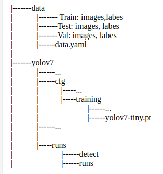

# AFORO VEHICULAR

  
   

Weights version of YOLOv7:
* Small: https://github.com/WongKinYiu/yolov7/releases/download/v0.1/yolov7-tiny.pt
* Medium: https://github.com/WongKinYiu/yolov7/releases/download/v0.1/yolov7.pt
* Large: https://github.com/WongKinYiu/yolov7/releases/download/v0.1/yolov7-e6e.pt

We use tiny model modificaing <code> nc: 2  # number of classes</code> in cfg directory

Files structure:

Comand to train YOLO:

<code>!python train.py --batch-size 10 --data "../data/FineTuned_YOLO/data.yaml" --img 1080 1920 --weight "./yolov7-tiny.pt" --name yolov7-custom --epoch 10</code>

For more see the last cells of <code>FineTunning-YOLO.ipynb</code>

################

https://github.com/donskytech/python-flask-socketio?tab=readme-ov-file
https://github.com/krishnaik06/Flask-Web-Framework/tree/main/Tutorial%207
https://ron.sh/creating-real-time-charts-with-flask/
https://www.youtube.com/watch?v=dm3FcR_WrvQ
https://www.youtube.com/watch?v=q2kdLki8wRY&t=46s
https://www.donskytech.com/python-flask-websockets/